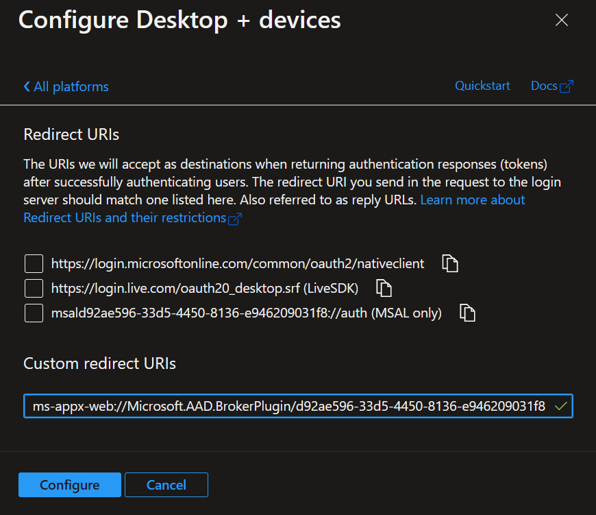
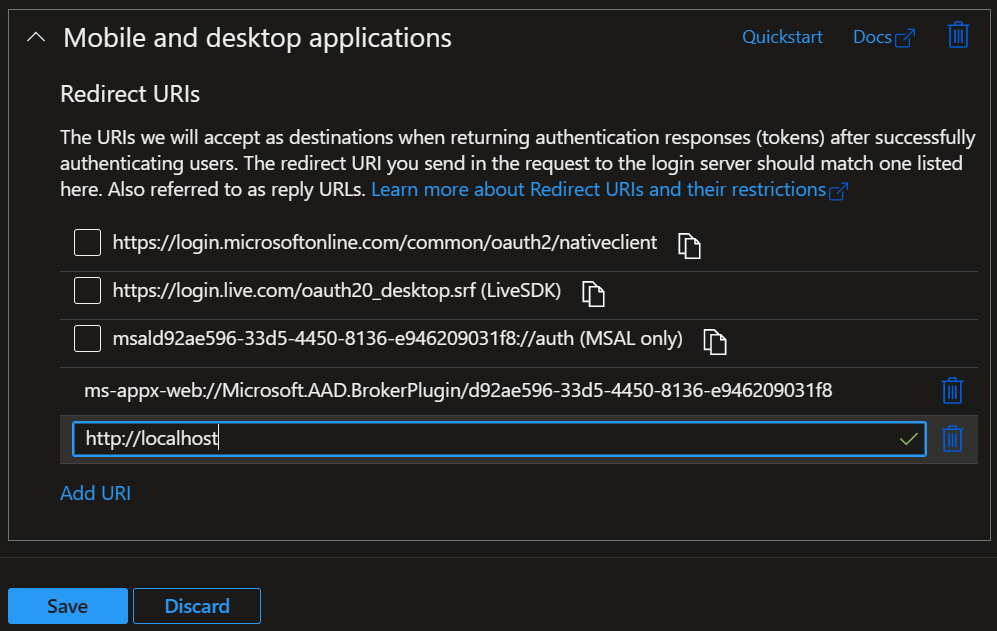
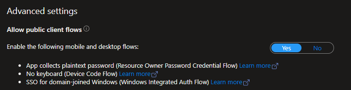

# Usage
AzureAuth is a generic Azure credential provider. It currently supports the following modes of [public client authentication](https://docs.microsoft.com/en-us/azure/active-directory/develop/msal-client-applications) (i.e., authenticating a human user.)
* [IWA (Integrated Windows Authentication)](https://docs.microsoft.com/en-us/azure/active-directory/develop/scenario-desktop-acquire-token-integrated-windows-authentication)
* [WAM (Web Account Manager)](https://docs.microsoft.com/en-us/azure/active-directory/develop/scenario-desktop-acquire-token-wam) (Windows only brokered authentication)
* [Embedded Web View](https://docs.microsoft.com/en-us/azure/active-directory/develop/msal-net-web-browsers) (Windows Only)
* [System Web Browser](https://docs.microsoft.com/en-us/azure/active-directory/develop/msal-net-web-browsers) (Used on OSX in-place of Embedded Web View)
* [Device Code Flow](https://github.com/AzureAD/microsoft-authentication-library-for-dotnet/wiki/Device-Code-Flow) (All platforms, terminal interface only).

## Requirements
This CLI is a "pass-through" for using [MSAL.NET](https://github.com/AzureAD/microsoft-authentication-library-for-dotnet). This means it does not provide any client ID (aka app registration) by default. You must register and configure your own app registration to authenticate with.

### Configure your App Registration
1. Follow [this quick start guide](https://docs.microsoft.com/en-us/azure/active-directory/develop/quickstart-register-app) to setup your application.
2. Configure redirect URIs for **WAM** (the Windows broker)
   1. Select the **Authentication** blade.
   2. Under Platform configurations, select **Add a platform**.
   3. In the Configure platforms pane, select **Mobile and desktop applications**.
   4. In the Configure Desktop + devices pane, under Custom redirect URIs, specify   
      ```
      ms-appx-web://Microsoft.AAD.BrokerPlugin/<ClientID>  
      ``` 
   5. Select **Configure**.

   

3. Configure redirect URIs for the **system web browser**
   1. Select the **Authentication** blade.
   2. Under Platform configurations, find **Mobile and desktop applications**
   3. Select **Add URI** and enter
       ```
       http://localhost
       ```
       (Note &mdash; do **not** use `https` here as this is for local redirect and TLS won't work.)
   4. Select **Save**.

   

4. To support public client auth modes enable the **Allow public client flows** setting, in the **Authentication** blade.

   

### Arguments to the CLI
You always need to pass at least these three arguments in order to authenticate as something (client id), to something (resource ID), within some AAD tenant. These IDs can be found in the Azure Portal on the Overview of each application/resource/tenant in the AAD section. 
1. A client ID. It is a unique application (client) ID assigned to your app by Azure AD when the app was registered.
2. A resource ID. It is a unique ID representing the resource which you want to authenticate to.
3. A tenant ID. (This is found on the main AAD page within the Azure Portal)

They can either be provided explicitly on the CLI or they can be given implicitly as part of a config file when given an alias.

#### Using config file
AzureAuth config files use the [TOML](https://toml.io/en/) file format. Here is a sample config file.

```toml
[alias.alias1]
# The resource ID
resource = "67eeda51-3891-4101-a0e3-bf0c64047157"
# The client ID
client = "73e5793e-8f71-4da2-9f71-575cb3019b37"
domain = "contoso.com"
tenant = "a3be859b-7f9a-4955-98ed-f3602dbd954c"

[alias.alias2]
resource = "ab7e45b7-ea4c-458c-97bd-670ccb543376"
client = "73e5793e-8f71-4da2-9f71-575cb3019b37"
domain = "fabrikam.com"
tenant = "a3be859b-7f9a-4955-98ed-f3602dbd954c"
```

Usage:
```
azureauth --alias alias1 --config <path to the config file>
```

or if you set the environment variable `AZUREAUTH_CONFIG` to the config file path, you can omit the option `--config` and use the below command.

```
azureauth --alias alias1
```

## Shelling out to AzureAuth CLI
"Shelling out" (executing as a subprocess) to AzureAuth CLI is highly recommended to have the best possible authentication experience. 
This insulates your application from potentially lots of dependency headaches, and churn as the authentication libraries used under the hood update, as do the means of authenticating.

### Output formats
Use the option `--output` to get the token in the desired formats. Available choices:
1. `--output token` returns token in plain text.
2. `--output json` returns a JSON string of the following format:
    ```json
    {
        "user": "<user@example.com>",
        "display_name": "User Name",
        "token": "<encoded token>",
        "expiration_date": "<expiration date in unix format>"
    }
    ```
3. `--output status` returns the status of the authentication and the cache.
4. `--output none` returns nothing.

## Setting custom timeout
Azureauth defaults to a 15 minute timeout. You can override this with a custom timeout value using `--timeout`. The value is interpreted as a decimal number of minutes. The example below will wait 10 minutes and 45 seconds.

Usage:
```
azureauth --alias alias1 --timeout 10.75
```

Use the command `azureauth --help` to understand more available options.

### Examples
1. Sample python code available [here](../examples/python/).
2. Sample command to authenticate your client to a resource under a tenant. 
    ```
    azureauth --client <clientID> --resource <resourceID> --tenant <tenantID> --output <output format>
    ```
